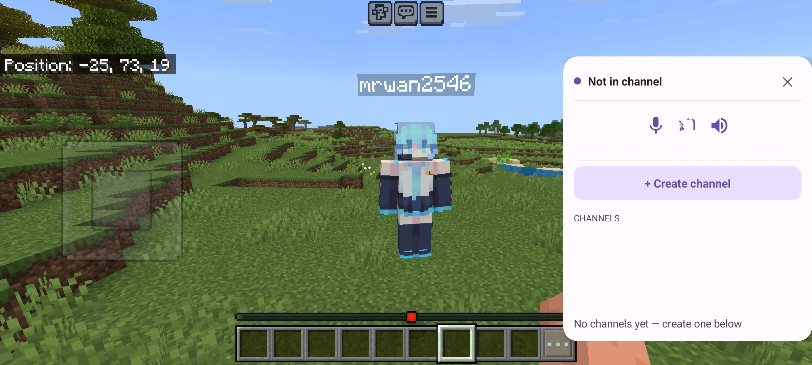
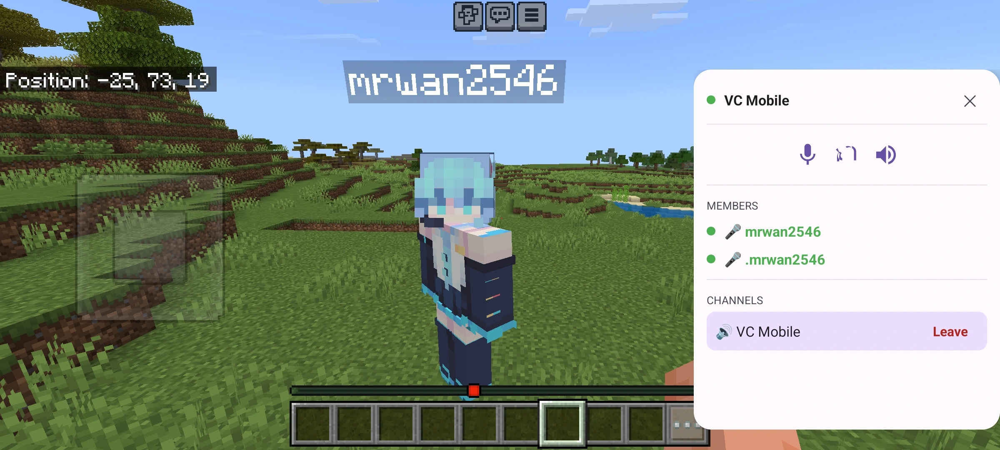
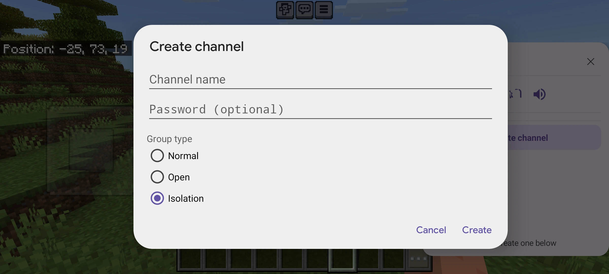

# SVCGeyser

Bedrock voice-chat bridge for **PaperMC** servers running **GeyserMC**, **Floodgate**, and **Simple Voice Chat (SVC)**.


---

## What is this?

SVCGeyser lets **Minecraft Bedrock** players use proximity voice chat on a Java server — the same voice system that **Simple Voice Chat** provides to Java mod users.

Bedrock players install a companion **Android app**. Their microphone audio is injected into SVC on the server, and they hear everything SVC would normally send to a Java mod client: proximity chat, voice groups, and whisper. Java players with the SVC mod and Bedrock players using the app can talk to each other in the same world.

**XUID is the join key.** The app proves identity with a Microsoft / Xbox token. Floodgate maps that XUID to the in-game Bedrock player. Gamertag strings are never trusted.

```
Android app  ── WebSocket (JSON + Opus) ──  SVCGeyser plugin  ── SVC API ──  Java SVC mod clients
 (Kotlin)                                      (Paper)              (UDP)
```

Audio format (fixed by SVC): **Opus, 48 kHz mono, 20 ms frames** (960 samples per packet).

---

## Requirements

| Component | Notes |
|-----------|-------|
| **Paper** 1.21.4 | Java 21 server (built and tested against this version) |
| [**GeyserMC**](https://geysermc.org/) | Required — Bedrock players join the Java server |
| [**Floodgate**](https://wiki.geysermc.org/floodgate/) | Required — exposes Bedrock XUIDs to the plugin |
| [**Simple Voice Chat**](https://modrinth.com/plugin/simple-voice-chat) | Required — Bukkit/Paper plugin ≥ 2.6.x (not Fabric/Forge mod alone) |
| **SVCGeyser plugin** | This repository's Paper plugin |
| **SVCGeyser Android app** | Companion app for Bedrock players (Android 7.0+ / API 24) |

Spigot or other forks may work if SVC and Floodgate load correctly, but only **Paper 1.21.4** is officially supported.

---

## Installation

### Plugin (server)

1. Install **GeyserMC**, **Floodgate**, and **Simple Voice Chat** in your server's `plugins/` folder. Start the server once so they generate configs.

2. Install **SVCGeyser** — download a release jar, or build from source:

   ```bash
   cd plugin
   ./gradlew shadowJar
   ```

   Copy `plugin/build/libs/svcgeyser-*.jar` into `plugins/`.

3. Restart the server and [configure the plugin](#plugin-configuration).

4. Open the WebSocket port (default `9000`) in your firewall so players' phones can reach it.

   On success, the console shows:

   ```
   [SVCGeyser] SVC API acquired — bridge ready
   [SVCGeyser] Bridge WS server listening on port 9000
   ```

### App (Android)

1. Download [Concentus v1.0-java](https://github.com/lostromb/concentus/releases/tag/v1.0-java) and place the JAR at:

   ```
   app/app/libs/Concentus.jar
   ```

2. Build the debug APK:

   ```bash
   cd app
   ./gradlew assembleDebug
   ```

   Output: `app/app/build/outputs/apk/debug/app-debug.apk`

3. Install the APK on the player's Android device (sideload or `adb install`).

The app requests **microphone**, **internet**, and optionally **display over other apps** (floating bubble overlay while in Minecraft).

---

## Plugin configuration

After the first start, edit `plugins/SVCGeyser/config.yml`:

```yaml
ws-port: 9000
jwt-secret: "change-me-to-a-long-random-secret"
```

| Setting | Description |
|---------|-------------|
| `ws-port` | WebSocket port the Android app connects to (default `9000`). |
| `jwt-secret` | **Change before production.** Used to sign app session tokens. |

The app connects to `ws://<server-ip>:<ws-port>`. Use your server's public IP or hostname — not `localhost`, unless testing on the same machine.

For public internet deployment over TLS, put a reverse proxy in front and use `wss://`. Built-in TLS is not yet supported (see [Limitations](#limitations)).

---

## Usage (players)

1. **Sign in** in the app with the same Microsoft / Xbox account linked to your Bedrock profile.
2. **Add a server** (IP/hostname and WebSocket port) and tap **Connect**.
3. Join the Minecraft server on **Bedrock** (via Geyser).
4. Wait until the app shows **In game**, then grant **microphone** permission.
5. **Join or create a voice channel** from the room list. Use mute, deafen, and speaker/earpiece controls as needed.

Voice channels in the app map 1:1 to SVC groups on the server. When joining a Java-created password-protected group, enter the password in the app.

---

## Limitations

| Limitation | Details |
|------------|---------|
| **Android only** | No iOS companion app yet. |
| **Plain WebSocket** | App uses `ws://` only. `wss://` requires an external reverse proxy. |
| **Paper 1.21.4** | Other server versions are untested. |
| **SVC mod on Bedrock client** | If a Bedrock player also has the SVC mod installed, bridge uplink is rejected (`uplink_rejected — mod installed`). |
| **Java-created group types** | Groups created in-game via the SVC mod UI use whatever type the Java player picks. Only **Isolated** fully blocks outside proximity audio. The app defaults to Isolated when creating channels. |
| **Group password reflection** | Password checks for Java-created protected groups rely on SVC internal fields (v2.6.13). A future SVC update may break this until the plugin is updated. |
| **Manual Concentus setup** | `Concentus.jar` must be downloaded and placed manually before building the app. |
| **Rate limiting & metrics** | Not implemented yet (planned Phase 6). |

---

## Screenshots

### Server connect & room list



### Join a voice channel



### Create a channel



---

## Troubleshooting

| Symptom | What to check |
|---------|---------------|
| Stuck on **Waiting for player** | Bedrock player must be online on the same server with the **same Microsoft account** used in the app. Geyser + Floodgate must be running. |
| Java players can't hear Bedrock | Look for `Audio sender registered` in console. If you see `Uplink frame dropped`, SVC sender never registered. |
| Bedrock can't hear Java | Look for `Audio listener registered`. Check mic permission and mute/deafen in the app. |
| WebSocket fails | Verify `ws-port` is open and reachable from the phone. Confirm `jwt-secret` is set. |

Full protocol and design details: [`docs/DOCUMENT.md`](docs/DOCUMENT.md) · [`docs/SUMMARY.md`](docs/SUMMARY.md)

---

## Development

```
SVCGeyser/
├── plugin/          # Paper plugin (Java 21, Gradle)
├── app/             # Android companion (Kotlin, Jetpack Compose)
├── docs/            # Design doc, images, protocol spec
└── test/            # TypeScript WebSocket test harness (Bun)
```

```bash
cd plugin && ./gradlew shadowJar    # plugin jar
cd app    && ./gradlew assembleDebug # debug APK
cd app    && ./gradlew test         # unit tests
```

---

## License & credits

- **Simple Voice Chat** — [maxhenkel](https://github.com/MaxHenkel) / [modrepo.de API](https://voicechat.modrepo.de)
- **GeyserMC / Floodgate** — [GeyserMC](https://github.com/GeyserMC)
- **Concentus** — pure-Java Opus ([lostromb/concentus](https://github.com/lostromb/concentus))
